<center>
<h1>
In The Name Of God
</h1>
<b>
Advanced Programming - Homework 1
  </b>

Dr.Amir Jahanshahi |
<a href="https://github.com/omidrazzaghi2000">Omid Razzaghi</a>
</br>
<b>Student:</b>
Rabih ND

</center>

# Introduction
  At this homework we want to code and train with vector and smart pointer. 
He has a csv file that it shows details of his books.
# PERCEPTRON
The brain is complex, but can generally be divided into a small number of parts and basic 
operations. 

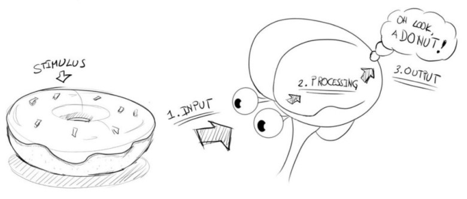

The nerve is the basic unit for calculations in the brain, each nerve receives and 
integrates chemical signals from other nerves.

<div style="text-align: center">
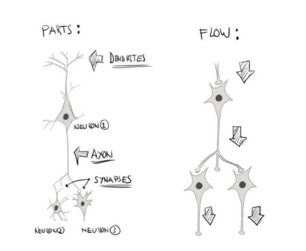
</div>

In the field of artificial neural networks, perceptron is a type of artificial neuron, capable 
of converting a sample to zero or one output.

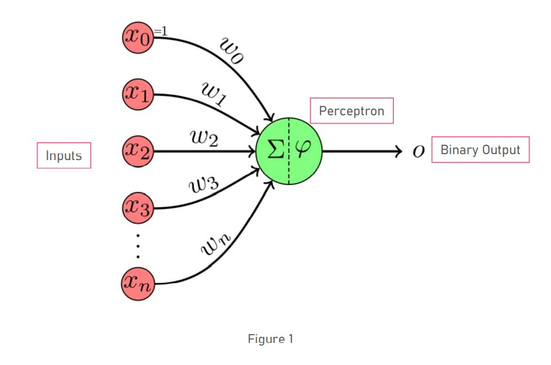

# How it works
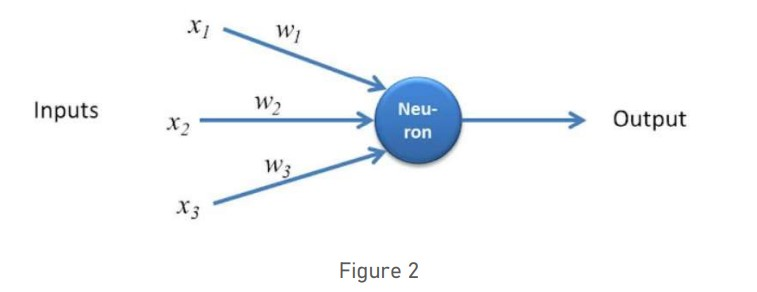
<div style="text-align: justify">
    How the perceptron works is illustrated in Figure 1. In the example, the perceptron has three inputs x1 , x2 , x3 and one output. The importance of this inputs is determined by the corresponding weights W1 , W2 , W3 assigned to this inputs. The output could be 0 or 1 depending on the weighted sum of the inputs. Output is 0 if the sum is below certain threshold or 1 if the output is above certain threshold. This threshold could be a real number and a parameter of the neuron. Since the output of the perceptron could be either 0 or 1, this perceptron is an example of  binary classifier. 
</div>

<div style="text-align: center">
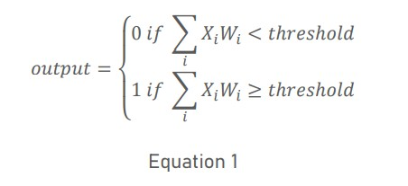
</div>

Ok Let’s go to code and make a perceptron to classification. 

**Question: What if when all inputs are zero?**

No matter what the weights are, the output is zero. Thus, in perceptron algorithm we add bias to handle this situation. As you can see at Figure 1 𝑥0 =1 and 𝑤0 is bias. 

# PERCEPTRON WITH C++
<div style="text-align: justify">
In this exciting homework we want to classify binary data with one perceptron. At first we need to write function to import data from csv(comma-separated values) file and return data as vector of shared pointer of vector. Vectors are sequence containers representing arrays that can change in size and shared_ptr is smart pointer In the phrase “int * p” p is raw pointer and you see this pointer before but in this homework, we want to work with smart pointers.
</div>
<div style="text-align: center">
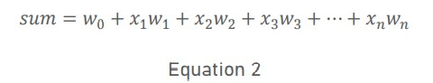
</div>


```c++
std::vector<std::shared_ptr<std::vector<double>>> read_csv(std::string filename)
```
After import data from csv file, Let’s move on the next function “predict” which obtain output by weight and input.

```c++
int predict(std::vector<double> X,std::vector<double> weights)
```
This function calculate sum according to Equation 2 and obtain output of perceptron with Equation 1. 

**Question: where do weights of perceptron obtained?**

Let’s understand this with a simple classification example 
</div>
<div style="text-align: center">
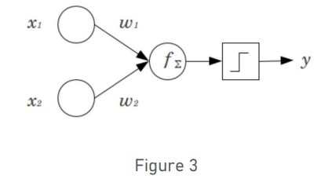
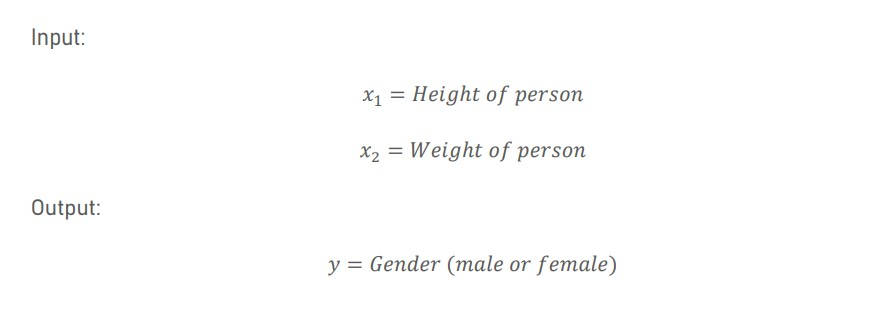
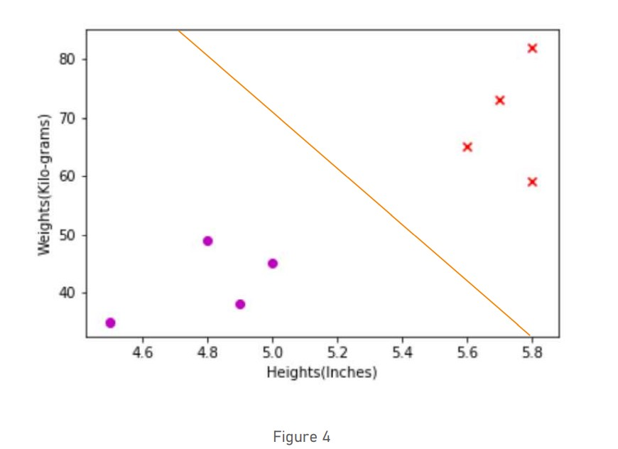
</div>
<div style="text-align: justify">
Our motive is to fit a decision boundary (a line) that separates all the male samples from the female samples. We have two inputs; therefore, we need two weights and one bias. </div>
<div style="text-align: center">
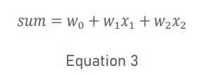
</div>
Perceptron use an iterative algorithm to train weights and find optimum ones. This algorithm updates each weight with below equation. 
<div style="text-align: center">
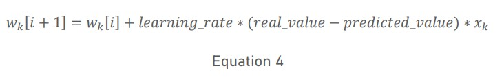
</div>
For updating 𝑤0 (bias) suppose 𝑥0 = 1. Ok for training eights we use function below: 

```c++
std::vector<double> train_weight(std::vector<std::shared_ptr<std::vector<double>>> train,double learning_rate,double number_epoch)
```

<div style="text-align: justify">
<b>train</b> is dataset that use for training weights and we suppose that initial value for all weights is zero. Learning rate is constant value 0.1. and “number_epoch” is number of 
repeating perceptron algorithm. For example, we have weights and heights of 100 women and we use “train_weights” function to use 75 data and update weights. After this operation as many as the number of epochs, repeat this function again. Finally, we have training weights so we can test these with 25 test dataset and score accuracy of this algorithm. Declare function perceptron which get train dataset, test dataset, learning rate and number of epochs to do all the operation describe above. 
</div>

```c++
void Perceptron (std::vector<std::shared_ptr<std::vector<double>>> train ,std::vector<std::shared_ptr<std::vector<double>>> test, double learning_rate , int number_epochs)
```
Output:
<div style="text-align: center">
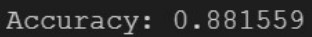
</div>

> You must not alter the main.cpp file at all. Just write all > your codes in the aphw1.cpp and aphw1.h. Good luck!

---

## My result:

<div style="text-align: center">
<b><u>Accuracy = 94.012 %</u></b></br>
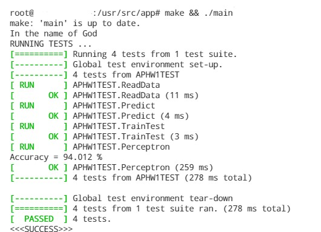
</div>

---
